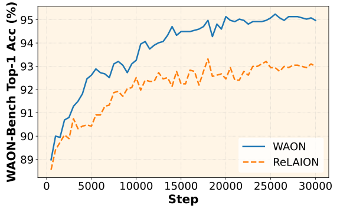
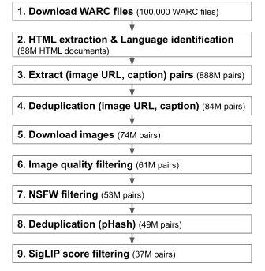

<div align="center">

# WAON
### Large-Scale and High-Quality Japanese Image-Text Pair Dataset for Vision-Language Models
| [📃Paper](https://arxiv.org/abs/2510.22276) | [🤗HuggingFace](https://huggingface.co/collections/speed/waon) | [🧑‍💻Code](https://github.com/llm-jp/WAON) |



</div>


## Introduction
In this work, we introduce **WAON**, a large-scale and high-quality Japanese image-text pair dataset containing approximately 155 million examples, collected from Common Crawl.
To evaluate its effectiveness, we also construct **WAON-Bench**, a manually curated benchmark for Japanese cultural image classification.
In our experiments, we fine-tune SigLIP2, a strong multilingual model, on both WAON and the Japanese subset of ReLAION, one of the most influential vision-language datasets. The results demonstrate that WAON enhances model performance on WAON-Bench more efficiently than ReLAION and achieves higher accuracy across all tasks. Furthermore, the model fine-tuned on WAON achieves state-of-the-art performance on several Japanese cultural benchmarks.


## Repository Overview
This repository contains the code to construct WAON, a large-scale and high-quality Japanese image-text pair dataset for vision-language models.

## Setup

Install dependencies using uv:
```bash
uv sync
source .venv/bin/activate
```

When you install fasttext, you may need to define `CC` and `CXX` environment variables to `gcc` and `g++` respectively.
```bash
CC=gcc  CXX=g++  uv add fasttext
```


## Constructing the WAON Dataset

The WAON dataset is constructed through the following pipeline:
<div align="center">



</div>

### 1. Collect WARC File URLs

We begin by collecting URLs of WARC files from Common Crawl.
```bash
python src/crawl_mm/waon_cc/cc2url.py
```

### 2. Download and Extract HTML Files

Next, we download WARC files and extract HTML pages containing Japanese text.
(In this example, we limit the number of WARC files to 1 for testing.)
```bash
python src/crawl_mm/waon_cc/url2html.py --max_num_files 1
python src/crawl_mm/waon_cc/html2goodhtml.py
```

### 3. Extract Image-Text Pairs

We then extract image–text pairs from the processed HTML files.
```bash
python src/crawl_mm/waon_cc/goodhtml2pair.py
```

### 4. Deduplicate Image URLs and Captions

Duplicate image URLs and captions are removed.
```bash
python src/crawl_mm/waon_cc/deduplicate_image_url.py
```

### 5. Download Images

Images are downloaded from the corresponding URLs.
```bash
python src/crawl_mm/waon_cc/download_images.py
```

### 6. Filter by Image Size

We filter out unsuitable images based on resolution and aspect ratio.
```bash
python src/crawl_mm/waon_cc/image_size_filter.py
```

### 7. NSFW Filtering

Images containing NSFW content are filtered out using a pre-trained NSFW detection model.
```bash
python src/crawl_mm/waon_cc/nsfw_filter.py
```

### 8. Annotate Perceptual Hashes (pHash)

We compute perceptual hashes for each image to enable deduplication.
```bash
python src/crawl_mm/waon_cc/annotate_phash.py
```

### 9. Deduplicate Images by pHash

Images are deduplicated using a Bloom filter based on pHash similarity.
```bash
python src/crawl_mm/waon_cc/dedup_phash_bloom.py
```

### 10. Annotate CLIP Scores

Each image–text pair is annotated with a CLIP similarity score using the SigLIP2-base model.
```bash
python src/crawl_mm/waon_cc/annotate_clip_score.py
```

### 11. Filter by CLIP Score

Finally, image–text pairs with low CLIP scores are removed.
```bash
python src/crawl_mm/waon_cc/filter_low_clipscore.py
```


## Citation
Star us on GitHub if you find this repository useful! ⭐

If you find this work interesting, please cite our paper:
```bibtex
@misc{sugiura2025waonlargescalehighqualityjapanese,
      title={WAON: Large-Scale and High-Quality Japanese Image-Text Pair Dataset for Vision-Language Models},
      author={Issa Sugiura and Shuhei Kurita and Yusuke Oda and Daisuke Kawahara and Yasuo Okabe and Naoaki Okazaki},
      year={2025},
      eprint={2510.22276},
      archivePrefix={arXiv},
      primaryClass={cs.CV},
      url={https://arxiv.org/abs/2510.22276},
}
```